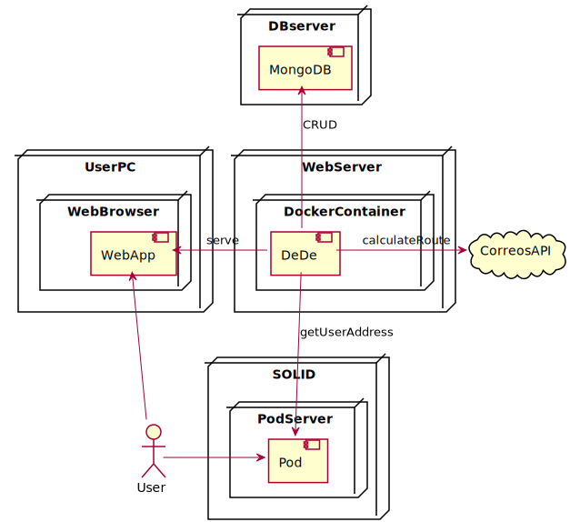

[[section-deployment-view]]

== Deployment View

[role="arc42help"]

=== Infrastructure Level 1

[role="arc42help"]

Motivation::

Our software would be nothing without a hardware to run it on and, of course, it will affect greatly the way our application behaves and performs under several different situations. Our goal is to have a correct understanding of the infraestructure over wich our system will be deployed.

Quality and/or Performance Features::

As we have stated before, privacy and security will be our main concerns. Having a good infraestructure and servers backing up our app, will be a crucial part for us to achieve this goals. 
Performance is also a thing to look after, but DeDe being a Web App, this will depend mostly on the server in which it runs, as well ass the users own internet connection.

Mapping of Building Blocks to Infrastructure::

[cols="1, 3"]
|===
    |*Building Block* | *Mapping to Infraestructure*
    |DeDe | This is the main application. It will run inside a docker container, which will be deployed in a server. The nature of this server is still to be determined.
    |WebApp | This is the user end of te application. It will be rendered by a web browser, which will be executed over the users personal computer or smart device, like phones, tablets...
    |Pod | These are the users Pods, where their address will be stored. They will be served by the SOLID project, and hosted in a server of the user's election.
    |MongoDB | This is the DataBase, which will be stored on a server as well. Like the application per se, the nature of this server is still to be determined.
    |CorreosAPI | This API will be used to calculate routes and costs of delivery. It will be hosted by a third party in a server of their choosing.
|===